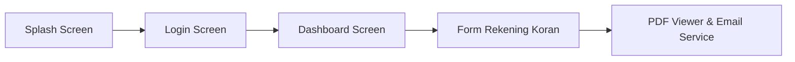

# 🏦 DIGI Bank BJB - Custom Mobile App & Analysis Project

[](https://flutter.dev)
[](https://dart.dev)
[](https://developer.android.com)
[](https://m3.material.io)

Projek pembangunan kembali (*rebuilding*) aplikasi mobile **DIGI bank bjb** menggunakan **Flutter Clean Architecture** dengan standar desain visual BJB (*Brand Guidelines*), serta dokumentasi hasil *reverse engineering* & analisis AOT Dart.

---

## 📑 Daftar Isi

- [🎯 Ringkasan & Tujuan Projek](#-ringkasan--tujuan-projek)
- [🎨 Design System & BJB Identity](#-design-system--bjb-identity)
- [📱 Alur Layar & Fitur Aplikasi](#-alur-layar--fitur-aplikasi)
- [🏗️ Arsitektur Kode Projek](#%EF%B8%8F-arsitektur-kode-projek)
- [📁 Struktur Direktori Workspace](#-struktur-direktori-workspace)
- [🛠️ Maintenance & Reverse Engineering Tools](#%EF%B8%8F-maintenance--reverse-engineering-tools)
- [🚀 Cara Memulai (Getting Started)](#-cara-memulai-getting-started)

---

## 🎯 Ringkasan & Tujuan Projek

Projek ini bertujuan untuk mereplikasi dan membangun aplikasi mobile **Flutter modern** berbasis *Material 3* dengan menggunakan identitas visual, skema warna, font, dan asset resmi **DIGI bank bjb** (`com.bjbsmb`). Aplikasi ini mengimplementasikan *workflow* perbankan khusus seperti cetak dan preview Rekening Koran serta otomatisasi pengiriman PDF ke email.

---

## 🎨 Design System & BJB Identity

Semua komponen UI/UX wajib mematuhi standar identitas visual Bank BJB:

| Elemen Design | Spec / Nilai Hex | Penggunaan & Keterangan |
| :--- | :--- | :--- |
| **Primary Color** | `#0083C9` (BJB Blue) | Header, Button Utama, Splash Screen |
| **Secondary Color** | `#00588A` (BJB Dark Blue) | Top Bar, Status Bar, Active State, Accent |
| **Background Color** | `#F5F7FA` (Light Grey) | Background Canvas & Card Container |
| **Font Family** | `Quicksand` | Digunakan untuk seluruh komponen teks (`Regular`, `SemiBold`, `Bold`) |
| **Border Radius** | `12.0` | Sudut kelengkungan Card, Text Field, dan Button |
| **Assets** | Diambil dari `decompiled_base` | Logo DIGI, icon autodebet, background gradient |

---

## 📱 Alur Layar & Fitur Aplikasi



1. **Splash Screen** (`splash_screen.dart`):
   * Tampilan awal berlatar belakang BJB Primary Blue (`#0083C9`).
   * Animasi logo DIGI bank bjb terpusat dengan transisi otomatis.
2. **Login Screen** (`login_screen.dart`):
   * Form autentikasi custom dengan *floating card*.
   * Input nama/identitas & password pengguna.
3. **Dashboard Screen** (`dashboard_screen.dart`):
   * Header profil pengguna BJB dan ringkasan saldo.
   * Grid menu pilihan dan tombol utama **"Cetak Rekening Koran"**.
4. **Form Rekening Koran** (`statement_form_screen.dart`):
   * Input rentang tanggal (*Date Range Picker*) & email tujuan.
   * Validasi form sebelum mencetak dokumen.
5. **PDF Viewer & Email Service** (`pdf_viewer_screen.dart` & `email_service.dart`):
   * In-app PDF Viewer dengan kontrol zoom dan download.
   * Layanan pengiriman file PDF Rekening Koran langsung ke email pengguna.

---

## 🏗️ Arsitektur Kode Projek

Struktur folder pada projek Flutter baru (`lib/`):

```text
lib/
├── main.dart                   # Root Application & BJB Theme Configuration
├── constants/
│   ├── app_colors.dart         # Konstanta Warna BJB (#0083C9, #00588A, #F5F7FA)
│   └── app_assets.dart         # Path Asset (Logo, Icon, Fonts, Backgrounds)
├── models/
│   ├── user_model.dart          # Data Model Pengguna & Profil
│   └── statement_request.dart  # Data Model Permintaan Rekening Koran
├── screens/
│   ├── splash_screen.dart       # Layar Splash
│   ├── login_screen.dart        # Layar Login
│   ├── dashboard_screen.dart    # Layar Dashboard Utama
│   ├── statement_form_screen.dart # Form Rekening Koran
│   └── pdf_viewer_screen.dart   # PDF Viewer & Status Pengiriman Email
├── services/
│   ├── email_service.dart       # Service Pengiriman Email PDF (SMTP/Mailer)
│   └── pdf_service.dart         # Service Pemrosesan & Penyimpanan PDF
└── widgets/
    ├── bjb_button.dart          # Custom Button dengan BJB Style
    ├── bjb_text_field.dart      # Custom Input Text Field
    └── bjb_app_bar.dart         # Custom App Bar BJB
```

---

## 📁 Struktur Direktori Workspace

 Workspace ini juga dilengkapi dengan artefak dekompilasi dan analisis untuk keperluan referensi dan pemeliharaan:

```text
bjbv2/
├── original_apk/             # File Biner APK Asli (com.bjbsmb)
│   └── base.apk
├── decompiled_base/          # Hasil Dekompilasi Android Native (JADX / Apktool)
│   ├── sources/              # Source code Java/Kotlin
│   └── resources/            # AndroidManifest.xml, Res, & Flutter Assets
├── native_libs/              # Native Libraries ARM64 (.so)
│   └── lib/arm64-v8a/
│       ├── libapp.so         # Flutter AOT Compiled Application
│       └── libflutter.so     # Flutter Engine Runtime
├── flutter_analysis/         # Hasil Analisis Dart AOT (Blutter)
│   ├── objs.txt              # Struktur Class, Method, & Tipe Data Dart
│   ├── pp.txt                # Dump Object Pool (String & Endpoint Constants)
│   ├── blutter_frida.js      # Script Frida Hooking Runtime
│   └── asm/                  # ARM64 Disassembly
└── tools/                    # Tooling Pembantu
    └── blutter/              # Engine Blutter Reverse Engineering Tool
```

---

## 🛠️ Maintenance & Reverse Engineering Tools

### 1. Pemasangan Split APK ke Emulator / Perangkat Test
```powershell
python -c "import glob, subprocess; apks = glob.glob('decompiled/resources/*.apk'); subprocess.run(['adb', 'install-multiple'] + apks)"
```

### 2. Membuka Aplikasi via ADB
```powershell
adb shell am start -n com.bjbsmb/.MainActivity
```

### 3. Dynamic Hooking Menggunakan Frida
Gunakan script Frida bawaan untuk menginspeksi atau mem-bypass fungsi runtime:
```powershell
frida -U -f com.bjbsmb -l flutter_analysis/blutter_frida.js
```

---

## 🚀 Cara Memulai (Getting Started)

### Prasyarat
- **Flutter SDK** `>= 3.22.0` (Dart `>= 3.6.0`)
- **Android Studio / VS Code** dengan Flutter Extension
- **Perangkat / Emulator Android** (Rekomendasi: Samsung / Android 10+)

### Langkah Jalankan Projek Flutter
1. Jalankan perintah untuk mengunduh dependency:
   ```bash
   flutter pub get
   ```
2. Pastikan emulator atau perangkat Android terhubung:
   ```bash
   flutter devices
   ```
3. Jalankan aplikasi:
   ```bash
   flutter run
   ```

---

## 📄 Lisensi & Catatan Keamanan

> [!IMPORTANT]
> Seluruh asset logo, nama merek, dan desain visual merupakan hak cipta milik **PT Bank Pembangunan Daerah Jawa Barat dan Banten, Tbk (Bank BJB)**.
> Kode dalam projek ini ditujukan untuk tujuan pengujian internal, pemeliharaan (*maintenance*), dan pengembangan aplikasi custom.
